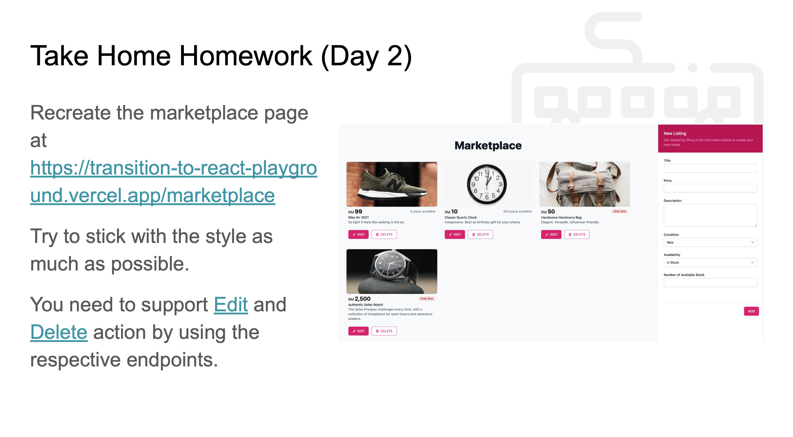

# FrontendDev Homework (Day 2)



# Dockerised the my-react-app

To enable you to view my-react-app, I have dockerised it and pushed up to my docker repo.

Please pull my docker container with the command below and view it at http://localhost:3000

```bash
docker run -d -p 3000:80 james1122/react-hw-day2
```

# Completed

## MarketPlaceForm component (completed)
reference: https://www.digitalocean.com/community/tutorials/how-to-build-forms-in-react

see the following files:
* src/pages/marketplace.jsx
* src/components/marketplace-form.jsx
* src/components/listing-item.jsx (modified slightly doit-17's listing-item.jsx)

## Completed the following functions to interface with api
* editItem function (completed)
* updateItem function (completed)
* deleteItem function (completed)
